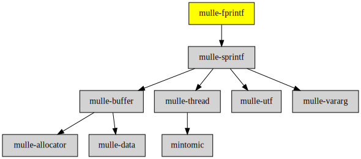

# mulle-fprintf

#### 🔢 mulle-fprintf marries mulle-sprintf to stdio.h


| Release Version                                       | Release Notes
|-------------------------------------------------------|--------------
|  [](//github.com/mulle-core/mulle-fprintf/actions) | [RELEASENOTES](RELEASENOTES.md) |


## API

| Function         | Description
|------------------|-------------
| `mulle_printf`   | Like [printf](//www.cplusplus.com/reference/cstdio/printf/) prints to **stdout**
| `mulle_vprintf`  | `<stdarg.h>` variant of `mulle_printf`
| `mulle_fprintf`  | Prints to `FILE`
| `mulle_vfprintf` | `<stdarg.h>` variant of `mulle_fprintf`


## Usage

mulle-sprintf must be "force" linked (all-load) with mulle-fprintf,
otherwise the plugin conversions don't appear. mulle-sde will do this automatically.


### You are here




## Add

**This project is a component of the [mulle-core](//github.com/mulle-core/mulle-core) library. As such you usually will *not* add or install it
individually, unless you specifically do not want to link against
`mulle-core`.**


### Add as an individual component

Use [mulle-sde](//github.com/mulle-sde) to add mulle-fprintf to your project:

``` sh
mulle-sde add github:mulle-core/mulle-fprintf
```

To only add the sources of mulle-fprintf with dependency
sources use [clib](https://github.com/clibs/clib):


``` sh
clib install --out src/mulle-core mulle-core/mulle-fprintf
```

Add `-isystem src/mulle-core` to your `CFLAGS` and compile all the sources that were downloaded with your project.


## Install

### Install with mulle-sde

Use [mulle-sde](//github.com/mulle-sde) to build and install mulle-fprintf and all dependencies:

``` sh
mulle-sde install --prefix /usr/local \
   https://github.com/mulle-core/mulle-fprintf/archive/latest.tar.gz
```

### Manual Installation

Install the requirements:

| Requirements                                 | Description
|----------------------------------------------|-----------------------
| [mulle-sprintf](https://github.com/mulle-core/mulle-sprintf)             | 🔢 An extensible sprintf function supporting stdarg and mulle-vararg

Download the latest [tar](https://github.com/mulle-core/mulle-fprintf/archive/refs/tags/latest.tar.gz) or [zip](https://github.com/mulle-core/mulle-fprintf/archive/refs/tags/latest.zip) archive and unpack it.

Install **mulle-fprintf** into `/usr/local` with [cmake](https://cmake.org):

``` sh
cmake -B build \
      -DCMAKE_INSTALL_PREFIX=/usr/local \
      -DCMAKE_PREFIX_PATH=/usr/local \
      -DCMAKE_BUILD_TYPE=Release &&
cmake --build build --config Release &&
cmake --install build --config Release
```


## Author

[Nat!](https://mulle-kybernetik.com/weblog) for Mulle kybernetiK  


