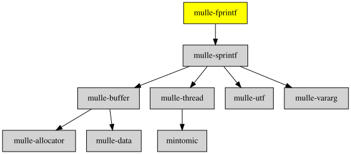

# mulle-fprintf

#### 🔢 mulle-fprintf marries mulle-sprintf to stdio.h

See [mulle-sprintf](//github.com/mulle-core/mulle-sprintf) for details about
the supported conversions.

## Streaming printf, zero heap allocation

`mulle_printf`, `mulle_fprintf`, `mulle_vfprintf`, and `mulle_mvfprintf` pipe
the full power of the mulle-sprintf formatting engine straight to your
`FILE *` — through a stack-backed flushable buffer. No heap churn, no
arbitrary-size limits, no dribbling bytes: output is buffered on the stack and
flushed in one batched `fwrite`. Write as much as you like; the streaming
design keeps it allocation-free and fast.

## One API for `FILE *` and `mulle_buffer *`

mulle-fprintf ships a stdio-compatible interface on `mulle_buffer` — including
a portable `fmemopen` replacement that works on macOS and Windows. Use the
`mulle_stdio_functions` and `mulle_buffer_functions` vtables to write I/O code
**once** and run it against a real `FILE *` **or** an in-memory `mulle_buffer *`,
unchanged. Perfect for testable, storage-agnostic code.


| Release Version                                       | Release Notes  | AI Documentation
|-------------------------------------------------------|----------------|---------------
|  [](//github.com/mulle-core/mulle-fprintf/actions) | [RELEASENOTES](RELEASENOTES.md) | [DeepWiki for mulle-fprintf](https://deepwiki.com/mulle-core/mulle-fprintf)


## API

### Printf to FILE

| Function         | Description
|------------------|-------------
| `mulle_printf`   | Like [printf](//www.cplusplus.com/reference/cstdio/printf/) prints to **stdout**
| `mulle_vprintf`  | `<stdarg.h>` variant of `mulle_printf`
| `mulle_fprintf`  | Prints to `FILE`
| `mulle_vfprintf` | `<stdarg.h>` variant of `mulle_fprintf`
| `mulle_mvfprintf`| `mulle_vararg_list` variant of `mulle_fprintf`
| `mulle_mvprintf` | `mulle_vararg_list` variant of `mulle_printf`

### Stdio-compatible mulle_buffer I/O

These functions implement a stdio-like interface on `mulle_buffer`, allowing
code to work with either `FILE *` or `mulle_buffer *` via function pointers:

| Function                   | Description
|----------------------------|-------------
| `mulle_buffer_fmemopen`    | Cross-platform `fmemopen` replacement using `mulle_buffer`
| `mulle_buffer_fclose`      | Close and destroy a buffer opened with `mulle_buffer_fmemopen`
| `mulle_buffer_fread`       | Read from buffer (fread compatible)
| `mulle_buffer_fwrite`      | Write to buffer (fwrite compatible)
| `mulle_buffer_fgetc`       | Read a character from buffer
| `mulle_buffer_fputc`       | Write a character to buffer
| `mulle_buffer_fputs`       | Write a string to buffer
| `mulle_buffer_fseek`       | Seek within buffer
| `mulle_buffer_ftell`       | Get current position in buffer
| `mulle_buffer_fflush`      | Flush buffer (appends NUL in text mode)
| `mulle_buffer_stdio_lseek`  | `off_t`-based seek variant (stdio adapter)

### Vtables for polymorphic I/O

| Variable                   | Description
|----------------------------|-------------
| `mulle_stdio_functions`    | Function table dispatching to real `FILE *` stdio
| `mulle_buffer_functions`   | Function table dispatching to `mulle_buffer` functions

### File reading into mulle_buffer

| Function                          | Description
|-----------------------------------|-------------
| `mulle_buffer_init_with_filepath` | Read a file into a buffer
| `mulle_buffer_fread_FILE`         | Read N bytes from `FILE` into buffer
| `mulle_buffer_fread_FILE_all`     | Read entire `FILE` into buffer
| `mulle_buffer_do_filepath`        | RAII-style macro for file reading


## Documentation & Guides

* [API Summary](asset/dox/api/toc)

## Usage

### Printf-style output

``` c
#include <mulle-core/mulle-core.h>

int   main( void)
{
   mulle_printf( "%d: %s\n", 1848, "VfL Bochum");
   mulle_fprintf( stderr, "error: %s\n", "something went wrong");
   return( 0);
}
```

### Polymorphic I/O with vtables

Write I/O code once, use it with either `FILE *` or `mulle_buffer *`:

``` c
#include <mulle-core/mulle-core.h>

static void   write_greeting( struct mulle_buffer_stdio_functions *functions,
                              void *handle)
{
   (*functions->fputs)( "Hello", handle);
   (*functions->fputc)( '\n', handle);
}

int   main( void)
{
   struct mulle_buffer   buffer;

   // write to stdout via FILE *
   write_greeting( &mulle_stdio_functions, stdout);

   // write to a mulle_buffer
   mulle_buffer_init_with_capacity( &buffer, 64, NULL);
   write_greeting( &mulle_buffer_functions, &buffer);
   mulle_printf( "buffer contains: %.*s",
                 (int) mulle_buffer_get_length( &buffer),
                 mulle_buffer_get_bytes( &buffer));
   mulle_buffer_done( &buffer);

   return( 0);
}
```

### Cross-platform fmemopen

``` c
#include <mulle-core/mulle-core.h>

int   main( void)
{
   char   buf[ 64] = "Hello World";
   void   *stream;

   stream = mulle_buffer_fmemopen( buf, sizeof( buf), "r+");
   mulle_buffer_fputc( 'J', stream);
   mulle_buffer_fclose( stream);

   mulle_printf( "%s\n", buf);  // "Jello World"
   return( 0);
}
```

### Reading a file into a buffer

``` c
#include <mulle-core/mulle-core.h>

int   main( void)
{
   mulle_buffer_do_filepath( buffer, "example.txt", MULLE_BUFFER_IS_TEXT)
   {
      mulle_printf( "%.*s",
                    (int) mulle_buffer_get_length( buffer),
                    mulle_buffer_get_bytes( buffer));
   }
   return( 0);
}
```


### You are here




## Add

mulle-fprintf is a component of the [mulle-core](//github.com/mulle-core/mulle-core) library. So in your code include the mulle-core umbrella header:

``` c
#include <mulle-core/mulle-core.h>
```

### Add mulle-core to a cmake and git project

``` bash
git submodule add https://github.com/mulle-core/mulle-core.git mulle-core
```

Add this to your `CMakeLists.txt`:

``` cmake
add_subdirectory( mulle-core)
target_link_libraries( ${PROJECT_NAME} PRIVATE mulle-core)
```


### Add mulle-core to a mulle-sde project

``` sh
mulle-sde add github:mulle-core/mulle-core
```

### Embed mulle-fprintf with clib

``` sh
clib install --out src mulle-core/mulle-fprintf
```

Append `src` to your include path (e.g. add `-isystem src`  to your `CFLAGS`)
and compile all the sources that were downloaded.

## Install

Use [mulle-sde](//github.com/mulle-sde) to build and install mulle-fprintf and all dependencies:

``` sh
mulle-sde install --prefix /usr/local \
   https://github.com/mulle-core/mulle-fprintf/archive/latest.tar.gz
```

### Legacy Installation

Install the requirements:

| Requirements                                 | Description
|----------------------------------------------|-----------------------
| [mulle-sprintf](https://github.com/mulle-core/mulle-sprintf)             | 🔢 An extensible sprintf function supporting stdarg and mulle-vararg

Download the latest [tar](https://github.com/mulle-core/mulle-fprintf/archive/refs/tags/latest.tar.gz) or [zip](https://github.com/mulle-core/mulle-fprintf/archive/refs/tags/latest.zip) archive and unpack it.

Install **mulle-fprintf** into `/usr/local` with [cmake](https://cmake.org):

``` sh
PREFIX_DIR="/usr/local"
cmake -B build                               \
      -DMULLE_SDK_PATH="${PREFIX_DIR}"       \
      -DCMAKE_INSTALL_PREFIX="${PREFIX_DIR}" \
      -DCMAKE_PREFIX_PATH="${PREFIX_DIR}"    \
      -DCMAKE_BUILD_TYPE=Release &&
cmake --build build --config Release &&
cmake --install build --config Release
```


## Author

[Nat!](https://mulle-kybernetik.com/weblog) for Mulle kybernetiK  


